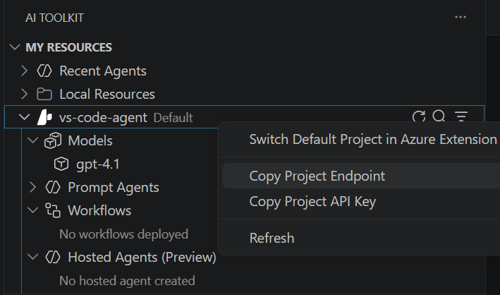

---
lab:
    title: 'Model Context Protocol(MCP) 도구로 에이전트 확장'
    description: 'Model Context Protocol(MCP) 서버 도구를 통합하여 에이전트 기능을 확장합니다.'
    level: 300
    duration: 60
    islab: true
    status: 'released'
---

# Model Context Protocol(MCP) 도구로 에이전트 확장

이 연습에서는 Foundry Toolkit for VS Code 확장을 사용하여 Model Context Protocol(MCP) 서버 도구를 통해 외부 데이터 원본 및 API에 액세스할 수 있는 에이전트를 만듭니다. 에이전트는 MCP 도구를 통해 최신 정보를 검색하고 사용자 지정 서비스와 상호 작용할 수 있습니다.

이 연습을 완료하는 데 약 **60**분이 걸립니다.

> **Note**: 이 연습에서 사용하는 일부 기술은 미리 보기 상태이거나 활발히 개발 중입니다. 예기치 않은 동작, 경고 또는 오류가 발생할 수 있습니다.

## 필수 구성 요소

이 연습을 시작하기 전에 다음이 준비되어 있는지 확인합니다.

- 로컬 컴퓨터에 설치된 [Visual Studio Code](https://code.visualstudio.com/)
- 활성 [Azure 구독](https://azure.microsoft.com/free/)
- 설치된 [Python 3.13](https://www.python.org/downloads/)
- 로컬 컴퓨터에 설치된 [Git](https://git-scm.com/downloads)

> \* Python 3.14는 아직 지원되지 않습니다. 일부 종속성에는 3.14 빌드가 없습니다. 이 랩은 Python 3.12로 테스트되었습니다.

## Foundry Toolkit for VS Code 확장으로 Foundry 프로젝트 만들기

개발자는 Foundry 포털에서 작업하는 시간도 있지만 Visual Studio Code에서 많은 시간을 보낼 가능성이 큽니다. Foundry Toolkit for VS Code 확장은 개발 환경을 벗어나지 않고 Foundry 프로젝트 리소스로 작업할 수 있는 편리한 방법을 제공합니다.

1. Visual Studio Code를 엽니다.

2. 왼쪽 창에서 **확장(Extensions)** 을 선택하거나 **Ctrl+Shift+X**를 누릅니다.

3. 확장 Marketplace에서 Microsoft의 `Foundry Toolkit` 확장을 검색하고 **설치(Install)** 를 선택합니다.

    > **Note**: 현재 확장은 **Foundry Toolkit**으로 표시되지만, 일부 VS Code 레이블, 명령 또는 이전 스크린샷에서는 여전히 **AI Toolkit**으로 표시될 수 있습니다. 이 랩에서는 이러한 이름이 동일한 확장 환경을 가리키는 것으로 간주합니다.

4. 확장을 설치한 후 사이드바에서 해당 아이콘을 선택하여 Foundry Toolkit 보기를 엽니다.

    아직 Azure 계정에 로그인하지 않았다면 로그인하라는 메시지가 표시됩니다.

5. **Microsoft Foundry Resources** 아래에서 **Create Project**를 선택합니다.

    기본 프로젝트가 이미 활성 상태이면 프로젝트 이름이 **My Resources** 아래에 표시됩니다. 활성 프로젝트를 마우스 오른쪽 단추로 클릭하고 **Switch Default Project in Azure Resources**를 선택하여 새 프로젝트를 만들 수 있습니다.

6. Azure 구독과 리소스 그룹을 선택한 다음, 이 연습을 위한 새 프로젝트를 만들 Foundry 프로젝트 이름을 입력합니다.

    배포가 완료되면 Foundry Toolkit 창에 프로젝트가 기본 프로젝트로 표시됩니다.

## 모델 배포

모든 생성형 AI 프로젝트의 핵심에는 하나 이상의 생성형 AI 모델이 있습니다. 이 작업에서는 에이전트와 함께 사용할 모델을 Model Catalog에서 배포합니다.

1. "Project deployed successfully" 팝업이 나타나면 **Deploy a new model** 단추를 선택합니다. 그러면 Model Catalog가 열립니다.

   > **Tip**: Resources 섹션의 **Models** 옆에 있는 **+** 아이콘을 선택하거나 **F1**을 누른 뒤 **Foundry Toolkit: Show model catalog** 명령을 실행하여 Model Catalog에 액세스할 수도 있습니다.

1. Model Catalog에서 **gpt-5** 모델을 찾습니다. 검색 창을 사용하면 빠르게 찾을 수 있습니다.

1. gpt-5 모델 옆의 **Deploy**를 선택합니다.

1. 배포 설정을 구성합니다.
   - **Deployment name**: "gpt-5"와 같은 이름을 입력합니다.
   - **Deployment type**: **Global Standard**를 선택합니다. Global Standard를 사용할 수 없는 경우 **Standard**를 선택합니다.
   - **Model version**: 기본값으로 둡니다.
   - **Tokens per minute**: Tokens per Minute 제한을 150000 이상으로 높입니다.

1. 왼쪽 아래 모서리에서 **Deploy to Microsoft Foundry**를 선택합니다.

1. 배포가 완료될 때까지 기다립니다. 배포된 모델은 Resources 보기의 **Models** 섹션 아래에 표시됩니다.

1. 프로젝트 배포 이름을 마우스 오른쪽 단추로 클릭하고 **Copy Project Endpoint**를 선택합니다. 다음 단계에서 에이전트를 Foundry 프로젝트에 연결하려면 이 URL이 필요합니다.

    

## 스타터 코드 리포지토리 복제

이 연습에서는 Foundry 프로젝트에 연결하고 MCP 서버 도구를 사용하는 에이전트를 만드는 데 도움이 되는 스타터 코드를 사용합니다.

1. VS Code에서 명령 팔레트(**Ctrl+Shift+P** 또는 **View > Command Palette**)를 엽니다.

1. **Git: Clone**을 입력하고 목록에서 선택합니다.

1. 리포지토리 URL을 입력합니다.

    ```
   https://github.com/MicrosoftLearning/mslearn-ai-agents.git
    ```

1. 로컬 컴퓨터에서 리포지토리를 복제할 위치를 선택합니다.

1. 메시지가 표시되면 **Open**을 선택하여 복제한 리포지토리를 VS Code에서 엽니다.

1. 리포지토리가 열리면 **File > Open Folder**를 선택하고 `mslearn-ai-agents/Labfiles/03-mcp-integration`으로 이동한 다음 **Select Folder**를 선택합니다.

1. 탐색기 창에서 **Python** 폴더를 확장하여 이 연습의 코드 파일을 확인합니다.

1. **requirements.txt** 파일을 마우스 오른쪽 단추로 클릭하고 **Open in Integrated Terminal**을 선택합니다.

1. 터미널에서 다음 명령을 입력하여 필요한 Python 패키지를 가상 환경에 설치합니다.

    ```
   python -m venv labenv
   .\labenv\Scripts\Activate.ps1
   pip install -r requirements.txt
    ```

1. **.env** 파일을 열고 **your_project_endpoint** 자리 표시자를 프로젝트 엔드포인트(Foundry Toolkit 확장의 프로젝트 배포 리소스에서 복사)로 바꾸고 MODEL_DEPLOYMENT_NAME 변수가 모델 배포 이름으로 설정되어 있는지 확인합니다. 이러한 변경을 완료한 후 **Ctrl+S**를 사용하여 파일을 저장합니다.

이제 외부 데이터 원본 및 API에 액세스하기 위해 MCP 서버 도구를 사용하는 AI 에이전트를 만들 준비가 되었습니다.

## Azure AI Agent를 원격 MCP 서버에 연결

이 작업에서는 원격 MCP 서버에 연결하고 AI 에이전트를 준비한 다음 사용자 프롬프트를 실행합니다.

1. 코드 편집기에서 **agent.py** 파일을 엽니다.

   > **Tip**: 코드를 추가할 때 올바른 들여쓰기를 유지해야 합니다. 주석의 들여쓰기 수준을 기준으로 사용합니다.

1. **Add references** 주석을 찾고 클래스를 가져오도록 다음 코드를 추가합니다.

    ```python
   # Add references
   from azure.identity import DefaultAzureCredential
   from azure.ai.projects import AIProjectClient
   from azure.ai.projects.models import PromptAgentDefinition, MCPTool
   from openai.types.responses.response_input_param import McpApprovalResponse, ResponseInputParam
    ```

1. **Connect to the agents client** 주석을 찾고 현재 Azure 자격 증명을 사용하여 Azure AI 프로젝트에 연결하도록 다음 코드를 추가합니다.

    ```python
   # Connect to the agents client
   with (
       DefaultAzureCredential() as credential,
       AIProjectClient(endpoint=project_endpoint, credential=credential) as project_client,
       project_client.get_openai_client() as openai_client,
   ):
    ```

1. **Initialize agent MCP tool** 주석 아래에 다음 코드를 추가합니다.

    ```python
   # Initialize agent MCP tool
   mcp_tool = MCPTool(
       server_label="api-specs",
       server_url="https://learn.microsoft.com/api/mcp",
       require_approval="always",
   )
    ```

    이 코드는 Microsoft Learn Docs 원격 MCP 서버에 연결합니다. 이 서버는 클라이언트가 Microsoft 공식 문서에서 직접 신뢰할 수 있는 최신 정보에 액세스할 수 있게 해 주는 클라우드 호스팅 서비스입니다.

1. **Create a new agent with the MCP tool** 주석 아래에 다음 코드를 추가합니다.

    ```python
   # Create a new agent with the MCP tool
   agent = project_client.agents.create_version(
       agent_name="MyAgent",
       definition=PromptAgentDefinition(
           model=model_deployment,
           instructions="You are a helpful agent that can use MCP tools to assist users. Use the available MCP tools to answer questions and perform tasks.",
           tools=[mcp_tool],
       ),
   )
   print(f"Agent created (id: {agent.id}, name: {agent.name}, version: {agent.version})")
    ```

    이 코드에서는 에이전트 지침을 제공하고 MCP 도구 정의를 제공합니다.

1. **Create a conversation thread** 주석을 찾고 다음 코드를 추가합니다.

    ```python
   # Create a conversation thread
   conversation = openai_client.conversations.create()
   print(f"Created conversation (id: {conversation.id})")
    ```

1. **Send initial request that will trigger the MCP tool** 주석을 찾고 다음 코드를 추가합니다.

    ```python
   # Send initial request that will trigger the MCP tool
   response = openai_client.responses.create(
       conversation=conversation.id,
       input="Give me the Azure CLI commands to create an Azure Container App with a managed identity.",
      extra_body={"agent_reference": {"name": agent.name, "type": "agent_reference"}},
   )
    ```

1. **Process any MCP approval requests that were generated** 주석을 찾고 다음 코드를 추가합니다.

    ```python
   # Process any MCP approval requests that were generated
   # The agent may issue several tool calls, each needing its own approval,
   # so we loop until there are none left.
   while True:
       # Collect any MCP approval requests from the latest response
       input_list: ResponseInputParam = []
       for item in response.output:
           if item.type == "mcp_approval_request":
               if item.server_label == "api-specs" and item.id:
                   # Automatically approve the MCP request to allow the agent to proceed
                   input_list.append(
                       McpApprovalResponse(
                           type="mcp_approval_response",
                           approve=True,
                           approval_request_id=item.id,
                       )
                   )

       # No more approvals needed -> the agent has produced its final response
       if not input_list:
           break

       # Send the approval response back and retrieve the next response
       response = openai_client.responses.create(
           input=input_list,
           previous_response_id=response.id,
           extra_body={"agent_reference": {"name": agent.name, "type": "agent_reference"}},
       )

   print(f"\nAgent response: {response.output_text}")
    ```

    이 코드는 에이전트 응답에 있는 MCP 승인 요청을 수신하고 자동으로 승인합니다.

1. **Clean up resources by deleting the agent version** 주석을 찾고 다음 코드를 추가합니다.

    ```python
   # Clean up resources by deleting the agent version
   project_client.agents.delete_version(agent_name=agent.name, agent_version=agent.version)
   print("Agent deleted")
    ```

1. 완료되면 코드 파일을 저장합니다(*CTRL+S*).

## 원격 MCP 서버 연결 테스트

이제 애플리케이션을 실행하고 에이전트가 MCP 도구를 사용하여 Microsoft Learn Docs 원격 MCP 서버에서 정보를 검색하는 방식을 확인할 준비가 되었습니다.

1. 통합 터미널에서 다음 명령을 입력하여 애플리케이션을 실행합니다.

    ```
   az login
    ```

    ```
   python agent.py
    ```

1. 에이전트가 MCP 서버를 사용하여 요청한 정보를 검색하기에 적합한 도구를 찾으며 프롬프트를 처리할 때까지 기다립니다. 다음과 유사한 출력이 표시됩니다.

    ```
   Agent created (id: MyAgent:2, name: MyAgent, version: 2)
   Created conversation (id: conv_086911ecabcbc05700BBHIeNRoPSO5tKPHiXRkgHuStYzy27BS)

   Agent response: Here are Azure CLI commands to create an Azure Container App with a managed identity:

   **1. For a System-assigned Managed Identity**
    ```sh
    az containerapp create \
    --name <CONTAINERAPP_NAME> \
    --resource-group <RESOURCE_GROUP> \
    --environment <CONTAINERAPPS_ENVIRONMENT> \
    --image <CONTAINER_IMAGE> \
    --identity 'system'
    ```

   [continued...]

   Agent deleted

    ```

    Notice that the agent was able to invoke the MCP tool to automatically fulfill the request.

1. You can update the input in the request to ask for different information. In each case, the agent will attempt to find technical documentation by using the MCP tool.

## Create an MCP server with custom tools

In addition to connecting to remote MCP servers, you can also create your own custom MCP server tools and connect them to your agent. A Model Context Protocol (MCP) Server is a component that hosts callable tools. These tools are Python functions that can be exposed to AI agents. When tools are annotated with `@mcp.tool()`, they become discoverable to the client, allowing an AI agent to call them autonomously during a conversation or task. In this task, you'll add tools that will allow an agent to perform inventory inquiries and recommendations.

1. Open the **server.py** file in the code editor.

    In this code file, you'll define the tools the agent can use to simulate a backend service for the retail store. Notice the server setup code at the top of the file. It uses `FastMCP` to quickly spin up an MCP server instance named "Inventory". This server will host the tools you define and make them accessible to the agent during the lab.

1. Under the comment **Add references**, add the following code:

    ```python
   # Add references
   from fastmcp import FastMCP
    ```

1. **Create an MCP server** 주석 아래에 다음 코드를 추가하여 새 MCP 서버 인스턴스를 만듭니다.

    ```python
   # Create an MCP server
   mcp = FastMCP(name="Inventory")
    ```

    이 코드는 "Inventory" 레이블로 새 MCP 서버를 초기화합니다.

1. **Add an inventory check mcp tool** 주석을 찾고 함수 정의 위에 다음 데코레이터를 추가합니다. 이제 다음과 같이 표시되어야 합니다.

    ```python
   # Add an inventory check mcp tool
   @mcp.tool()
   def get_inventory_levels() -> dict:
      # continued...
    ```

    이 사전은 샘플 재고를 나타냅니다. `@mcp.tool()` 데코레이터는 함수를 MCP 서버의 도구로 등록하여 LLM이 함수를 검색할 수 있도록 합니다.

1. **Add a weekly sales mcp tool** 주석을 찾고 함수 정의 위에 다음 데코레이터를 추가합니다. 이제 다음과 같이 표시되어야 합니다.

    ```python
   # Add a weekly sales mcp tool
   @mcp.tool()
   def get_weekly_sales() -> dict:
      # continued...
    ```

1. **Run the MCP server** 주석을 찾고 다음 코드를 추가하여 서버를 시작합니다.

    ```python
   # Run the MCP server
   mcp.run(show_banner=False)
    ```

    이 코드는 MCP 서버를 시작하여 도구를 검색하고 에이전트가 사용할 수 있게 합니다. `show_banner=False`를 설정하면 시작 배너가 stdout에 출력되는 것을 방지하여 MCP stdio 프로토콜이 손상되지 않도록 합니다.

1. 파일을 저장합니다(*CTRL+S*).

## 사용자 지정 MCP 서버에 연결할 MCP 클라이언트 구현

MCP 클라이언트는 도구를 검색하고 호출하기 위해 MCP 서버에 연결하는 구성 요소입니다. 사용자 프롬프트에 대한 응답으로 동적 도구 사용을 가능하게 하는 에이전트와 서버 호스팅 함수 사이의 브리지로 생각할 수 있습니다.

1. **client.py** 파일로 이동합니다.

1. **Add references** 주석을 찾고 클래스를 가져오도록 다음 코드를 추가합니다.

    ```python
   # Add references
   from mcp import ClientSession, StdioServerParameters
   from mcp.client.stdio import stdio_client
    ```

1. **connect_to_server** 메서드에서 **Start the MCP server** 주석을 찾고 다음 코드를 추가합니다.

    ```python
   # Start the MCP server
   stdio_transport = await exit_stack.enter_async_context(stdio_client(server_params))
   stdio, write = stdio_transport
    ```

    표준 프로덕션 설정에서는 서버가 클라이언트와 별도로 실행됩니다. 하지만 이 랩에서는 클라이언트가 표준 입력/출력 전송을 사용하여 서버를 시작합니다. 이렇게 하면 두 구성 요소 사이에 경량 통신 채널이 만들어지고 로컬 개발 설정이 단순화됩니다.

1. **Create an MCP client session** 주석을 찾고 다음 코드를 추가합니다.

    ```python
   # Create an MCP client session
   session = await exit_stack.enter_async_context(ClientSession(stdio, write))
   await session.initialize()
    ```

    이렇게 하면 이전 단계의 입력 및 출력 스트림을 사용하여 새 클라이언트 세션이 만들어집니다. `session.initialize`를 호출하면 MCP 서버에 등록된 도구를 검색하고 호출할 수 있도록 세션이 준비됩니다.

1. **List available tools** 주석 아래에 다음 코드를 추가하여 클라이언트가 서버에 연결되었는지 확인합니다.

    ```python
   # List available tools
   response = await session.list_tools()
   tools = response.tools
   print("\nConnected to server with tools:", [tool.name for tool in tools]) 
    ```

    이제 클라이언트 세션을 Azure AI Agent와 함께 사용할 준비가 되었습니다.

## MCP 도구를 에이전트에 연결

이 작업에서는 MCP 서버 도구를 에이전트에 연결하여 사용자 프롬프트에 대한 응답으로 에이전트가 도구를 호출할 수 있게 합니다.

> **Tip**: 코드를 추가할 때 올바른 들여쓰기를 유지해야 합니다. 주석의 들여쓰기 수준을 기준으로 사용합니다.

1. **chat_loop** 메서드에서 **Build a function for each tool** 주석을 찾고 다음 코드를 추가합니다.

    ```python
   # Build a function for each tool
   def make_tool_func(tool_name):
       async def tool_func(**kwargs):
           result = await session.call_tool(tool_name, kwargs)
           return result

       tool_func.__name__ = tool_name
       return tool_func

   # Store the functions in a dictionary for easy access when processing function calls
   functions_dict = {tool.name: make_tool_func(tool.name) for tool in tools}
    ```

    이 코드는 MCP 서버에서 사용할 수 있는 도구를 동적으로 래핑하여 AI 에이전트가 호출할 수 있게 합니다. 각 도구는 에이전트가 호출할 수 있는 비동기 함수로 변환됩니다.

1. **Create FunctionTool definitions for the agent** 주석을 찾고 다음 코드를 추가합니다.

    ```python
   # Create FunctionTool definitions for the agent
   mcp_function_tools: FunctionTool = []
   for tool in tools:
       function_tool = FunctionTool(
           name=tool.name,
           description=tool.description,
           parameters={
               "type": "object",
               "properties": {},
               "additionalProperties": False,
           },
           strict=True
       )
       mcp_function_tools.append(function_tool)
    ```

1. **Create the agent** 주석을 찾고 다음 코드를 추가합니다.

    ```python
   # Create the agent
   agent = project_client.agents.create_version(
       agent_name="inventory-agent",
       definition=PromptAgentDefinition(
           model=model_deployment,
           instructions="""
           You are an inventory assistant. Here are some general guidelines:
           - Recommend restock if item inventory < 10  and weekly sales > 15
           - Recommend clearance if item inventory > 20 and weekly sales < 5
           """,
           tools=mcp_function_tools
       ),
   )
    ```

   이러한 지침과 도구를 통해 에이전트는 도구를 호출하여 재고 및 판매 데이터를 검색한 다음 해당 정보를 사용하여 사용자에게 유용한 응답을 제공할 수 있습니다.

1. **Process function calls** 주석을 찾고 다음 코드를 추가합니다.

    ```python
   # Process function calls
   for item in response.output:
       if item.type == "function_call":
           # Retrieve the matching function tool
           function_name = item.name
           kwargs = json.loads(item.arguments)
           required_function = functions_dict.get(function_name)

           # Invoke the function
           output = await required_function(**kwargs)

           # Append the output text
           input_list.append(
              FunctionCallOutput(
                 type="function_call_output",
                 call_id=item.call_id,
                 output=output.content[0].text,
              )
           )
    ```

    이 코드는 에이전트 응답에 함수 호출이 있는지 수신하고, 해당 도구 함수를 호출한 다음 출력을 에이전트에 다시 보낼 수 있도록 준비합니다.

1. **Send function call outputs back to the model and retrieve a response** 주석을 찾고 다음 코드를 추가합니다.

    ```python
   # Send function call outputs back to the model and retrieve a response
   if input_list:
      response = openai_client.responses.create(
            input=input_list,
            previous_response_id=response.id,
            extra_body={"agent_reference": {"name": agent.name, "type": "agent_reference"}},
      )
   print(f"Agent response: {response.output_text}")
    ```

1. 완료되면 코드 파일을 저장합니다(*CTRL+S*).

## 에이전트로 사용자 지정 MCP 도구 테스트

1. 통합 터미널에서 다음 명령을 입력하여 애플리케이션을 실행합니다.

    ```
   python client.py
    ```

1. 메시지가 표시되면 다음과 같은 프롬프트를 입력합니다.

    다음 영문 또는 한국어 프롬프트 중 하나를 입력합니다.

    ```
   Show me the current inventory levels for all products.
    ```

    ```prompt
   모든 제품의 현재 재고 수준을 보여 주세요.
    ```

    > **Tip**: 속도 제한 초과로 앱이 실패하면 몇 초간 기다렸다가 다시 시도합니다. 구독에서 사용할 수 있는 할당량이 부족하면 모델이 응답하지 못할 수 있습니다.

    다음과 유사한 출력이 표시됩니다.

    ```
    MessageRole.AGENT:
    Agent response: Here are the current inventory levels for all items:

   - Moisturizer: 6
   - Shampoo: 8
   - Body Spray: 28
   [continued ...]

   Would you like recommendations for restocking or clearance? If so, I can check the weekly sales to advise accordingly.
    ```

    에이전트가 MCP 도구를 호출하여 재고 및 판매 데이터를 검색한 다음 해당 정보를 사용하여 사용자에게 유용한 응답을 제공할 수 있었음을 확인합니다.

1. 원한다면 대화를 계속할 수 있습니다. 스레드는 *상태 저장(stateful)* 이므로 대화 기록이 유지되며, 이는 에이전트가 각 응답에 대해 전체 컨텍스트를 가지고 있음을 의미합니다.

    다음과 같은 프롬프트를 입력해 봅니다.

    다음 영문 또는 한국어 프롬프트 중 하나를 입력합니다.

    ```
   Are there any products that should be restocked?
    ```

    ```prompt
   재입고해야 하는 제품이 있나요?
    ```

    다음 영문 또는 한국어 프롬프트 중 하나를 입력합니다.

    ```
   Which products would you recommend for clearance?
    ```

    ```prompt
   어떤 제품을 재고 정리 대상으로 추천하나요?
    ```

    다음 영문 또는 한국어 프롬프트 중 하나를 입력합니다.

    ```
   What are the best sellers this week?
    ```

    ```prompt
   이번 주 베스트셀러는 무엇인가요?
    ```

1. 애플리케이션을 종료하려면 `quit`을 입력합니다.

    터미널에서 Python 가상 환경을 종료하려면 `deactivate`도 사용할 수 있습니다.

## 정리

Foundry Toolkit for VS Code 확장을 살펴본 후에는 불필요한 Azure 비용이 발생하지 않도록 리소스를 정리해야 합니다.

### 모델 삭제

1. VS Code에서 **Azure Resources** 보기를 새로 고칩니다.

1. **Models** 하위 섹션을 확장합니다.

1. 배포한 모델을 마우스 오른쪽 단추로 클릭하고 **Delete**를 선택합니다.

### 리소스 그룹 삭제

1. [Azure 포털](https://portal.azure.com)을 엽니다.

1. Microsoft Foundry 리소스가 포함된 리소스 그룹으로 이동합니다.

1. **Delete resource group**을 선택하고 삭제를 확인합니다.

