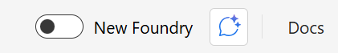
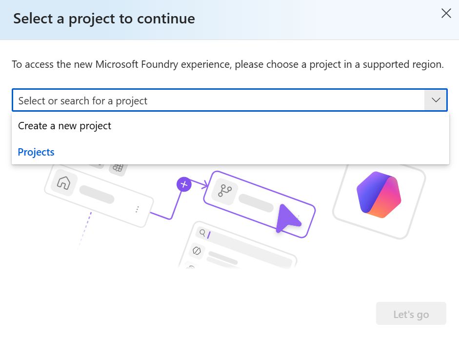
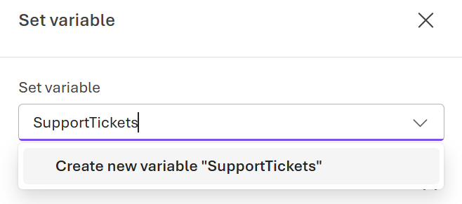
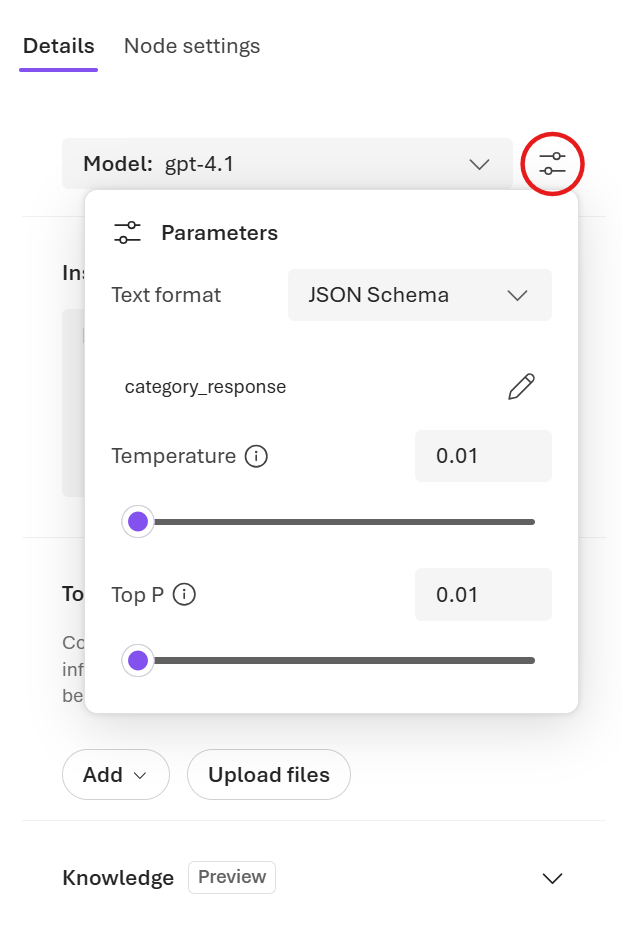

---
lab:
    title: 'Microsoft Foundry에서 워크플로 빌드'
    description: 'Microsoft Foundry 포털을 사용하여 AI 에이전트용 워크플로를 만듭니다.'
    level: 300
    duration: 45
    islab: true
    status: 'released'
---

# Microsoft Foundry에서 워크플로 빌드

이 연습에서는 Microsoft Foundry 포털을 사용하여 워크플로를 만듭니다. 워크플로는 AI 에이전트와 관련된 작업 시퀀스를 정의할 수 있는 UI 기반 도구입니다. 이 연습에서는 고객 지원 요청 해결을 돕는 워크플로를 만듭니다.

**워크플로 개요**

- 수신 지원 티켓 수집

    워크플로는 미리 정의된 고객 지원 문제 배열로 시작합니다. 배열의 각 항목은 ContosoPay에 제출된 개별 지원 티켓을 나타냅니다.

- 티켓을 한 번에 하나씩 처리

    For-each 루프가 배열을 반복하여, 동일한 워크플로 논리를 사용하면서도 각 지원 티켓이 독립적으로 처리되도록 합니다.

- AI 에이전트로 각 티켓 분류

    각 티켓에 대해 워크플로는 Triage Agent를 호출하여 문제를 Billing, Technical 또는 General로 분류하고 신뢰도 점수를 함께 제공합니다.

- 조건부 논리로 불확실성 처리

    신뢰도 점수가 정의된 임계값보다 낮으면 워크플로는 해당 티켓에 대한 추가 정보를 권장합니다.

- 문제 범주에 따라 라우팅

    Billing 문제는 에스컬레이션 대상으로 표시되고 자동 해결 경로에서 제외됩니다.
    Technical 및 General 문제는 자동 처리 과정을 계속 진행합니다.

- 권장 응답 생성

    Billing이 아닌 티켓의 경우 워크플로는 Resolution Agent를 호출하여 범주에 맞는 지원 응답 초안을 작성합니다.

이 연습을 완료하는 데 약 **30**분이 걸립니다.

> **Note**: Microsoft Foundry의 워크플로 빌더는 현재 미리 보기로 제공됩니다. 예기치 않은 동작, 경고 또는 오류가 발생할 수 있습니다. 진행을 막는 문제가 발생하면 새 프로젝트와 워크플로로 다시 시작해야 할 수 있습니다.

## 필수 구성 요소

이 연습을 시작하기 전에 다음 항목이 있는지 확인합니다.

- 로컬 컴퓨터에 [Visual Studio Code](https://code.visualstudio.com/)가 설치되어 있어야 합니다.
- 활성 [Azure 구독](https://azure.microsoft.com/free/)이 있어야 합니다.
- [Python 3.13](https://www.python.org/downloads/)이 설치되어 있어야 합니다.
- 로컬 컴퓨터에 [Git](https://git-scm.com/downloads)이 설치되어 있어야 합니다.

> \* Python 3.14는 아직 지원되지 않습니다. 일부 종속성에는 3.14 빌드가 없습니다. 이 랩은 Python 3.13.12로 테스트되었습니다.

## Foundry 프로젝트 만들기

먼저 Foundry 프로젝트를 만들어 보겠습니다.

1. 웹 브라우저에서 `https://ai.azure.com`의 [Foundry 포털](https://ai.azure.com)을 열고 Azure 자격 증명으로 로그인합니다.

1. **New Foundry** 토글이 *On*으로 설정되어 있는지 확인합니다.

    

2. New Foundry 환경을 계속 진행하기 전에 새 프로젝트를 만들라는 메시지가 표시될 수 있습니다. **Create a new project**를 선택합니다.

    

    메시지가 표시되지 않으면 왼쪽 위의 프로젝트 드롭다운 메뉴를 선택한 다음 **Create new project**를 선택합니다.

3. 텍스트 상자에 Foundry 프로젝트 이름을 입력하고 **Create**를 선택합니다.

    프로젝트가 만들어질 때까지 잠시 기다립니다. 새 Foundry 포털 홈 페이지가 프로젝트가 선택된 상태로 표시됩니다.

4. **Welcome to the new Microsoft Foundry** 대화 상자가 나타나면 닫습니다.

    대화 상자에서 에이전트를 만들라는 메시지가 표시될 수 있지만 지금은 필요하지 않습니다. 에이전트는 이후 단계에서 만들어집니다.

## 고객 지원 심사 워크플로 만들기

이 섹션에서는 ContosoPay라는 가상의 회사에 대한 고객 지원 요청을 심사하고 응답하는 데 도움이 되는 워크플로를 만듭니다. 워크플로는 지원 티켓을 분류하고 응답하는 두 개의 AI 에이전트를 사용합니다.

1. Foundry 포털 홈 페이지에서 도구 모음 메뉴의 **Build**를 선택합니다.

1. 왼쪽 메뉴에서 **Agents**를 선택한 다음 **Workflows** 탭을 선택합니다.

1. 오른쪽 위 모서리에서 **Create** > **Blank workflow**를 선택하여 새 빈 워크플로를 만듭니다.

    이 연습에서 만들 워크플로 유형은 순차 워크플로입니다. 하지만 빈 워크플로로 시작하면 필요한 노드를 추가하는 과정이 간단해집니다.

1. 시각화 도구에서 **Save**를 선택하여 새 워크플로를 저장합니다. 대화 상자에서 워크플로 이름(예: *`ContosoPay-Customer-Support-Triage`(ContosoPay 고객 지원 심사)*)을 입력한 다음 **Save**를 선택합니다.

## 티켓 배열 변수 만들기

1. 워크플로 시각화 도구에서 **+**(더하기) 아이콘을 선택하여 새 노드를 추가합니다.

1. 워크플로 작업 메뉴의 **Data transformation** 아래에서 **Set variable**을 선택하여 지원 티켓 배열을 초기화하는 노드를 추가합니다.

2. **Set variable** 노드 편집기에서 새 변수 이름(예: *SupportTickets*)을 입력합니다.

    

    새 변수는 `Local.SupportTickets`로 표시됩니다.

3. **To value** 필드에 샘플 지원 티켓이 포함된 다음 배열을 입력합니다.

    ```output
   [ 
    "The API returns a 403 error when creating invoices, but our API key hasn't changed.", 
    "Is there a way to export all invoices as a CSV?", 
    "I was charged twice for the same invoice last Friday and my customer is also seeing two receipts. Can someone fix this?"]
    ```

4. **Done**을 선택하여 노드를 저장합니다.

## 티켓을 처리할 for-each 루프 추가

1. **Set variable** 아래의 **+**(더하기) 아이콘을 선택하고 배열의 각 지원 티켓을 처리할 **For each** 노드를 만듭니다.

1. **For each** 노드 편집기에서 **Select the items to loop for each** 필드를 앞에서 만든 변수인 `Local.SupportTickets`로 설정합니다.

1. **Loop Value Variable** 필드에서 `CurrentTicket`이라는 새 변수를 만듭니다.

1. **Done**을 선택하여 노드를 저장합니다.

## 티켓을 분류할 에이전트 호출

1. **For each** 노드 내의 **+**(더하기) 아이콘을 선택하여 현재 지원 티켓을 분류하는 새 노드를 추가합니다.

2. 워크플로 작업 메뉴의 **Invoke** 아래에서 **Agent**를 선택하여 에이전트 노드를 추가합니다.

3. **Agent** 노드 편집기의 **Select an agent** 아래에서 **Create new agent**를 선택합니다.

4. 에이전트 이름(예: *`Triage-Agent`(심사 에이전트)*)을 입력하고 **Create**를 선택합니다.

### 에이전트 설정 구성

1. 편집기의 **Details** 아래에서 모델 이름 근처의 **Parameters** 단추를 선택합니다.

    

2. **Parameters** 창에서 **Text format** 옆의 **JSON Schema**를 선택합니다.

3. **Add response format** 창에서 다음 정의를 입력하고 **Save**를 선택합니다.

    ```json
   {
   "name": "category_response",
   "schema": {
       "type": "object",
       "properties": {
           "customer_issue": {
               "type": "string"
           },
           "category": {
               "type": "string"
           },
           "confidence": {
               "type": "number"
           }
       },
       "additionalProperties": false,
       "required": [
           "customer_issue",
           "category",
           "confidence"
       ]
   },
   "strict": true
   }
    ```

4. Agent Details 창에서 **Instructions** 필드를 다음 프롬프트로 설정합니다.

    ```output
   Classify the user's problem description into exactly ONE category from the list below. Provide a confidence score from 0 to 1.

   Billing
   - Charges, refunds, duplicate payments
   - Missing or incorrect payouts
   - Subscription pricing or invoices being charged

   Technical
   - API errors, integrations, webhooks
   - Platform bugs or unexpected behavior

   General
   - How-to questions
   - Feature availability
   - Data exports, reports, or UI navigation

   Important rules
   - Questions about exporting, viewing, or downloading invoices are General, not Billing
   - Billing ONLY applies when money was charged, refunded, or paid incorrectly
    ```

    다음 영문 또는 한국어 프롬프트 중 하나를 입력합니다.

    ```prompt
   사용자의 문제 설명을 아래 목록에서 정확히 하나의 범주로 분류합니다. 0에서 1 사이의 신뢰도 점수를 제공합니다.

   Billing
   - 청구, 환불, 중복 결제
   - 누락되었거나 잘못된 지급
   - 구독 가격 책정 또는 청구된 송장

   Technical
   - API 오류, 통합, 웹후크
   - 플랫폼 버그 또는 예기치 않은 동작

   General
   - 사용 방법 질문
   - 기능 사용 가능 여부
   - 데이터 내보내기, 보고서 또는 UI 탐색

   중요 규칙
   - 송장 내보내기, 보기 또는 다운로드에 관한 질문은 Billing이 아니라 General입니다.
   - Billing은 금액이 잘못 청구, 환불 또는 지급된 경우에만 적용됩니다.
    ```

5. **Node settings**를 선택하여 에이전트의 입력과 출력을 구성합니다.

6. **Input message** 필드를 `Local.CurrentTicket` 변수로 설정합니다.

7. **Save agent output message as** 아래에서 `TriageOutputText`라는 새 변수를 만듭니다.

8. **Save the output json_object as** 아래에서 `TriageOutputJson`이라는 새 변수를 만듭니다.

9. **Done**을 선택하여 노드를 저장합니다.

## 신뢰도가 낮은 분류 처리

1. **Invoke agent** 노드 아래의 **+**(더하기) 아이콘을 선택하여 신뢰도가 낮은 분류를 처리하는 새 노드를 추가합니다.

1. 워크플로 작업 메뉴의 **Flow** 아래에서 **If/Else**를 선택하여 조건부 논리 노드를 추가합니다.

1. **If/Else** 노드 편집기에서 **Add a path** 단추를 선택하여 if-분기 조건을 만든 다음 연필 아이콘을 선택하여 조건을 편집합니다.

1. 신뢰도 점수가 0.6보다 큰지 확인하도록 **Condition** 필드를 다음 식으로 설정합니다.

    ```output
   Local.TriageOutputJson.confidence > 0.6
    ```

1. **Done**을 선택하여 노드를 저장합니다.

## 신뢰도가 낮은 티켓에 대한 추가 정보 권장

1. 시각화 도구에서 **If/Else condition** 노드의 **Else** 분기 아래에 있는 **+**(더하기) 아이콘을 선택하여 신뢰도가 낮은 티켓에 대한 추가 정보를 권장하는 새 노드를 추가합니다.

1. 워크플로 작업 메뉴의 **Basics** 아래에서 **Deliver a message**를 선택하여 메시지 보내기 작업을 추가합니다.

1. **Deliver a message** 노드 편집기에서 **Message to send** 필드를 다음 응답으로 설정합니다.

    ```output
   The support ticket classification has low confidence. Requesting more details about the issue: "{Local.CurrentTicket}"
    ```

1. **Done**을 선택하여 노드를 저장합니다.

## 범주에 따라 티켓 라우팅

이 섹션에서는 신뢰도 점수가 충분히 높을 때 분류된 범주에 따라 티켓을 라우팅하는 조건부 논리를 추가합니다.

1. 시각화 도구에서 **If/Else condition** 노드의 **If** 분기 아래에 있는 **+**(더하기) 아이콘을 선택하여 범주에 따라 티켓을 라우팅하는 새 노드를 추가합니다.

1. 워크플로 작업 메뉴의 **Flow** 아래에서 **If/Else**를 선택하여 또 다른 조건부 논리 노드를 추가합니다.

1. **If/Else** 노드 편집기에서 **Add a path** 단추를 선택하여 if-분기 조건을 만든 다음 연필 아이콘을 선택하여 조건을 편집합니다.

1. 티켓 범주가 "Billing"인지 확인하도록 **If Condition**을 다음 식으로 설정합니다.

    ```output
   Local.TriageOutputJson.category = "Billing"
    ```

1. **If/Else** 노드의 **If** 분기 아래에 있는 **+**(더하기) 아이콘을 선택하여 Billing이 아닌 티켓에 대한 응답 초안을 작성하는 새 노드를 추가합니다.

1. 워크플로 작업 메뉴의 **Basics** 아래에서 **Deliver a message**를 선택하여 메시지 보내기 작업을 추가합니다.

1. **Deliver a message** 노드 편집기에서 **Message to send**를 다음 응답으로 설정합니다.

    ```output
   Escalate billing issue to human support team.
    ```

1. **Done**을 선택하여 노드를 저장합니다.

## 권장 응답 생성

1. 시각화 도구에서 두 번째 **If/Else** 노드의 **Else** 분기 아래에 있는 **+**(더하기) 아이콘을 선택하여 Billing이 아닌 티켓에 대한 응답 초안을 작성하는 새 노드를 추가합니다.

2. 워크플로 작업 메뉴의 **Invoke** 아래에서 **Agent**를 선택하여 에이전트 노드를 추가합니다.

3. **Agent** 노드 편집기에서 **Create new agent**를 선택합니다.

4. 에이전트 이름(예: *`Resolution-Agent`(해결 에이전트)*)을 입력하고 **Create**를 선택합니다.

5. 에이전트 편집기에서 **Instructions** 필드를 다음 프롬프트로 설정합니다.

    ```output
   You are a customer support resolution assistant for ContosoPay, a B2B payments and invoicing platform.

   Your task is to draft a clear, professional, and friendly support response based on the issue category and customer message.

   Guidelines:
   If the issue category is Technical:
   Suggest 1–2 common troubleshooting steps at a high level.

   Avoid asking for logs, credentials, or sensitive data.

   Do not imply fault by the customer.
   If the issue category is General:
   Provide a concise, helpful explanation or guidance.
   Keep the response under 5 sentences.

   Tone:
   Professional, calm, and supportive
   Clear and concise
   No emojis

   Output:
   Return only the drafted response text.
   Do not include internal reasoning or analysis.
    ```

    다음 영문 또는 한국어 프롬프트 중 하나를 입력합니다.

    ```prompt
   당신은 B2B 결제 및 송장 발행 플랫폼인 ContosoPay의 고객 지원 해결 도우미입니다.

   당신의 작업은 문제 범주와 고객 메시지를 바탕으로 명확하고 전문적이며 친근한 지원 응답 초안을 작성하는 것입니다.

   지침:
   문제 범주가 Technical인 경우:
   일반적인 문제 해결 단계를 높은 수준에서 1~2개 제안합니다.

   로그, 자격 증명 또는 중요한 데이터를 요청하지 않습니다.

   고객에게 책임이 있다는 뉘앙스를 주지 않습니다.
   문제 범주가 General인 경우:
   간결하고 유용한 설명 또는 지침을 제공합니다.
   응답은 5문장 미만으로 유지합니다.

   어조:
   전문적이고 차분하며 지지적
   명확하고 간결함
   이모지 없음

   출력:
   작성된 응답 텍스트만 반환합니다.
   내부 추론이나 분석은 포함하지 않습니다.
    ```

6. **Node settings**를 선택하여 에이전트의 입력과 출력을 구성합니다.

7. **Input message** 필드를 `Local.TriageOutputText` 변수로 설정합니다.

8. **Save agent output message as** 아래에서 `ResolutionOutputText`라는 새 변수를 만듭니다.

9. **Done**을 선택하여 노드를 저장합니다.

## 워크플로 미리 보기

1. **Save** 단추를 선택하여 워크플로의 모든 변경 내용을 저장합니다.

1. **Preview** 단추를 선택하여 워크플로를 시작합니다.

1. 표시되는 채팅 창에 워크플로를 트리거할 텍스트(예: `Start processing support tickets.`)를 입력합니다.

1. 각 지원 티켓이 순서대로 처리되는 동안 워크플로를 관찰합니다. 채팅 창에서 워크플로가 생성한 메시지를 검토합니다.

    Billing 문제가 에스컬레이션되고 Technical 및 General 문제에는 초안 응답이 제공됨을 나타내는 출력이 표시됩니다. 예를 들면 다음과 같습니다.

    ```output
   Current Ticket:
   The API returns a 403 error when creating invoices, but our API key hasn't changed.


   Copilot said:
   Thank you for reaching out about the 403 error when creating invoices. This error typically indicates a permissions or access issue. 
   Please ensure that your API key has the necessary permissions for invoice creation and that your request is being sent to the correct endpoint. 
   If the issue persists, try regenerating your API key and updating it in your integration to see if that resolves the problem.
    ```

## 클라이언트 애플리케이션에서 워크플로 사용

이제 Foundry 포털에서 워크플로를 빌드하고 테스트했으므로 Azure AI Projects SDK를 사용하여 직접 작성한 코드에서도 호출할 수 있습니다. 이를 통해 워크플로를 애플리케이션에 통합하거나 실행을 자동화할 수 있습니다.

### 스타터 코드 리포지토리 복제

이 연습에서는 Foundry 프로젝트에 연결하고 워크플로를 호출하는 데 도움이 되는 스타터 코드를 사용합니다.

1. VS Code에서 명령 팔레트(**Ctrl+Shift+P** 또는 **View > Command Palette**)를 엽니다.

1. **Git: Clone**을 입력하고 목록에서 선택합니다.

1. 리포지토리 URL을 입력합니다.

    ```
   https://github.com/MicrosoftLearning/mslearn-ai-agents.git
    ```

1. 리포지토리를 복제할 로컬 컴퓨터의 위치를 선택합니다.

1. 메시지가 표시되면 **Open**을 선택하여 복제한 리포지토리를 VS Code에서 엽니다.

1. 리포지토리가 열리면 **File > Open Folder**를 선택하고 `mslearn-ai-agents/Labfiles/06-build-workflow-ms-foundry`로 이동한 다음 **Select Folder**를 선택합니다.

1. Explorer 창에서 **Python** 폴더를 확장하여 이 연습의 코드 파일을 봅니다. 

### 애플리케이션 구성

1. 브라우저에서 Foundry 포털의 워크플로 시각화 도구로 돌아갑니다.

2. 시각화 도구의 오른쪽 위 모서리에서 **Code**를 선택합니다. 그런 다음 **.env variables**를 선택하여 코드에서 Foundry 프로젝트에 연결하는 데 필요한 환경 변수를 봅니다.

3. Foundry 프로젝트의 엔드포인트 URL인 **AZURE_EXISTING_AIPROJECT_ENDPOINT** 변수 값을 복사합니다. VS Code에서 프로젝트에 연결하려면 이 값이 필요합니다. 

4. VS Code에서 **requirements.txt** 파일을 마우스 오른쪽 단추로 클릭하고 **Open in Integrated Terminal**을 선택합니다.

5. 터미널에서 다음 명령을 입력하여 필요한 Python 패키지를 가상 환경에 설치합니다.

    ```
   python -m venv labenv
   .\labenv\Scripts\Activate.ps1
   pip install -r requirements.txt
    ```

6. **.env** 파일을 열고 **your_project_endpoint** 자리 표시자를 프로젝트의 엔드포인트(워크플로 시각화 도구의 코드 탭에서 복사한 값)로 바꿉니다. 이러한 변경을 한 후 **Ctrl+S**를 사용하여 파일을 저장합니다.

### 코드에서 워크플로 호출

이제 워크플로를 호출하는 프로젝트를 만들 준비가 되었습니다. 시작해 보겠습니다.

1. 코드 편집기에서 **workflow.py** 파일을 엽니다.

1. 파일의 코드를 검토하고 각 에이전트 이름과 지침에 대한 문자열이 포함되어 있음을 확인합니다.

1. **Add references** 주석을 찾고 필요한 클래스를 가져오도록 다음 코드를 추가합니다.

    ```python
   # Add references
   from azure.identity import DefaultAzureCredential
   from azure.ai.projects import AIProjectClient
    ```

2. **Connect to the agents client** 주석을 찾고 다음 코드를 추가하여 Agents 클라이언트를 만듭니다.

    ```python
   # Connect to the AI Project client
   with (
       DefaultAzureCredential() as credential,
       AIProjectClient(endpoint=endpoint, credential=credential) as project_client,
       project_client.get_openai_client() as openai_client,
   ):
    ```

    이제 지원 티켓을 처리하는 특정 역할을 가진 여러 에이전트를 만들기 위해 AgentsClient를 사용하는 코드를 추가합니다.

    > **Tip**: 후속 코드를 추가할 때 올바른 들여쓰기 수준을 유지해야 합니다.

3. **Specify the workflow** 주석을 찾고 다음 코드를 추가합니다.

    ```python
    # Specify the workflow
    workflow = {
        "name": "ContosoPay-Customer-Support-Triage"
    }
    ```

    Foundry 포털에서 만든 워크플로의 이름과 버전을 사용해야 합니다.

4. **Create a conversation and run the workflow** 주석을 찾고 다음 코드를 추가하여 대화를 만들고 워크플로를 호출합니다.

    ```python
   # Create a conversation and run the workflow
   conversation = openai_client.conversations.create()
   print(f"Created conversation (id: {conversation.id})")

   stream = openai_client.responses.create(
       conversation=conversation.id,
       extra_body={"agent_reference" : {"name" : workflow["name"], "type": "agent_reference"}},
       input="Start",
       stream=True,
   )
    ```

    이 코드는 워크플로 실행의 출력을 콘솔로 스트리밍하여, 워크플로가 각 티켓을 처리할 때 메시지 흐름을 볼 수 있도록 합니다.

5. **Process events from the workflow run** 주석을 찾고 다음 코드를 추가하여 스트리밍된 출력을 처리하고 메시지를 콘솔에 출력합니다.

    ```python
   # Process events from the workflow run
   for event in stream:
       if (event.type == "response.completed"):
           print("\nResponse completed:")
           response = openai_client.responses.retrieve(event.response.id)
           print_workflow_output(response.output_text)
    ```

    이 코드는 워크플로 응답 완료를 수신 대기한 다음 최종 출력 텍스트를 검색하여 콘솔에 출력합니다. `print_workflow_output` 함수는 더 쉽게 읽을 수 있도록 출력을 형식화하는 코드 파일에 정의된 도우미 함수입니다.

6. **Clean up resources** 주석을 찾고 더 이상 필요하지 않은 대화를 삭제하도록 다음 코드를 입력합니다.

    ```python
   # Clean up resources
   openai_client.conversations.delete(conversation_id=conversation.id)
   print("\nConversation deleted")
    ```

7. **CTRL+S** 명령을 사용하여 코드 파일의 변경 내용을 저장합니다.

## 클라이언트 애플리케이션 테스트

이제 코드를 실행하고 AI 에이전트가 협업하는 모습을 볼 준비가 되었습니다.

1. 통합 터미널에서 다음 명령을 실행합니다.
    ```
   az login
    ```

    ```
   python workflow.py
    ```

1. 워크플로가 티켓을 처리할 때까지 잠시 기다립니다. 워크플로가 실행되는 동안 에이전트가 생성한 메시지와 각 작업의 상태 업데이트를 포함하여 워크플로의 진행 상황을 나타내는 출력이 콘솔에 표시됩니다.

1. 워크플로가 완료되면 다음과 유사한 출력이 표시됩니다.

    ```output
   Response completed:
   Current Ticket:
   The API returns a 403 error when creating invoices, but our API key hasn't changed.{"customer_issue":"API returns a 403 error when creating invoices, API key unchanged.","category":"Technical","confidence":1}Thank you for contacting us about the 403 error when creating invoices with the API. This error typically relates to permission issues. Please ensure your API key has the necessary permissions for invoice creation and that the endpoint URL is correct. If the issue persists, try regenerating the API key and updating it in your application.
   ...
    ```

    출력에서 워크플로가 각 지원 티켓을 완료하는 방식(각 티켓의 분류와 권장 응답 또는 에스컬레이션 포함)을 확인할 수 있습니다. 잘하셨습니다!

2. 완료되면 터미널에 `deactivate`를 입력하여 Python 가상 환경을 종료합니다.

## 정리

Microsoft Foundry에서 워크플로 탐색을 마쳤으면 불필요한 Azure 비용이 발생하지 않도록 이 연습에서 만든 리소스를 삭제해야 합니다.

1. `https://portal.azure.com`의 [Azure portal](https://portal.azure.com)로 이동하고 Foundry 프로젝트가 배포된 리소스 그룹의 내용을 확인합니다.

1. 도구 모음에서 **Delete resource group**을 선택합니다.
1. 리소스 그룹 이름을 입력하고 삭제할 것인지 확인합니다.
